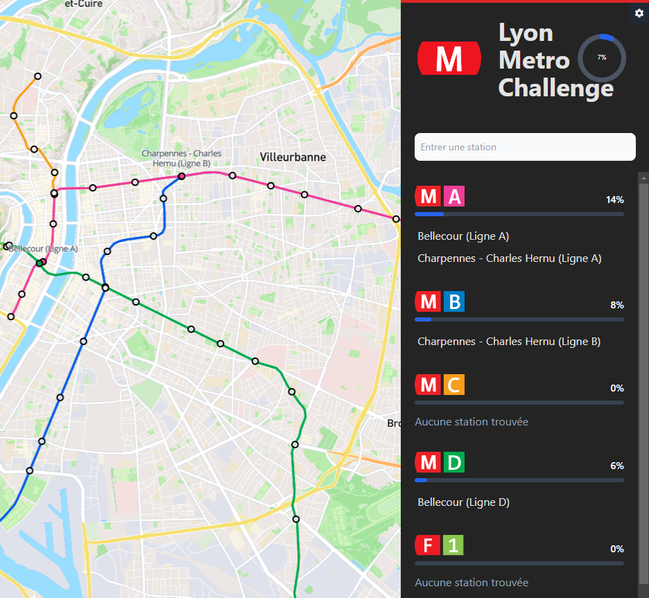

# Lyon Metro Challenge

> Lyon Metro Challenge : trouve autant de stations de métros que tu peux !  

Inspiré du jeu [memory.pour.paris](https://memory.pour.paris/) créé par Benjamin TD ([@_benjamintd](https://twitter.com/_benjamintd)) avec son accord explicite.    

